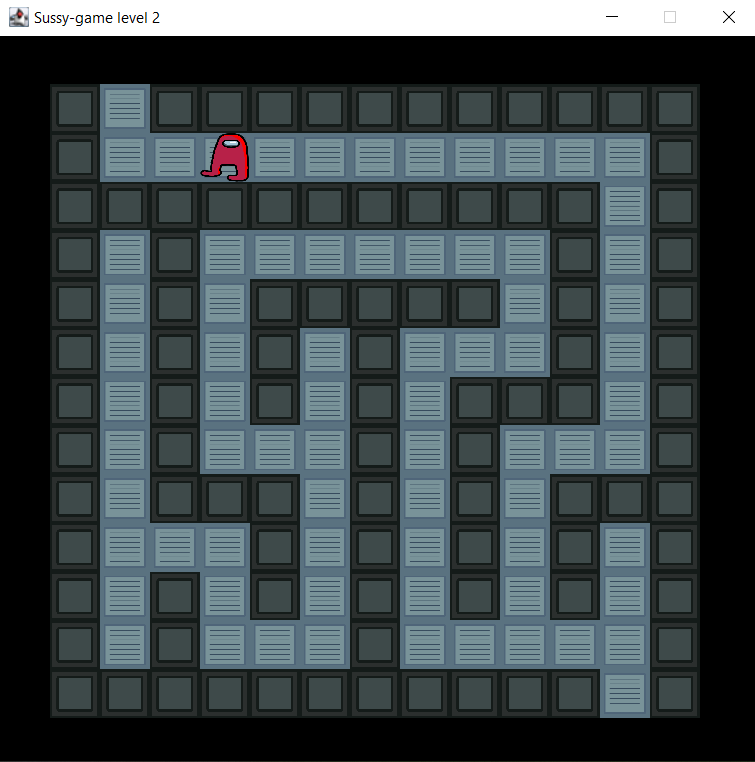

# Description
Simple maze game made using Java featuring a very suspicious impostor.  
Project done for Programs Engineering class at ACIEE UGAL  

# Functionality
The game generates a random labyrinth on a n*n grid.  
You are a red character and your purpose is to solve the maze. Every time you pass a level, the map grid gets larger.  

